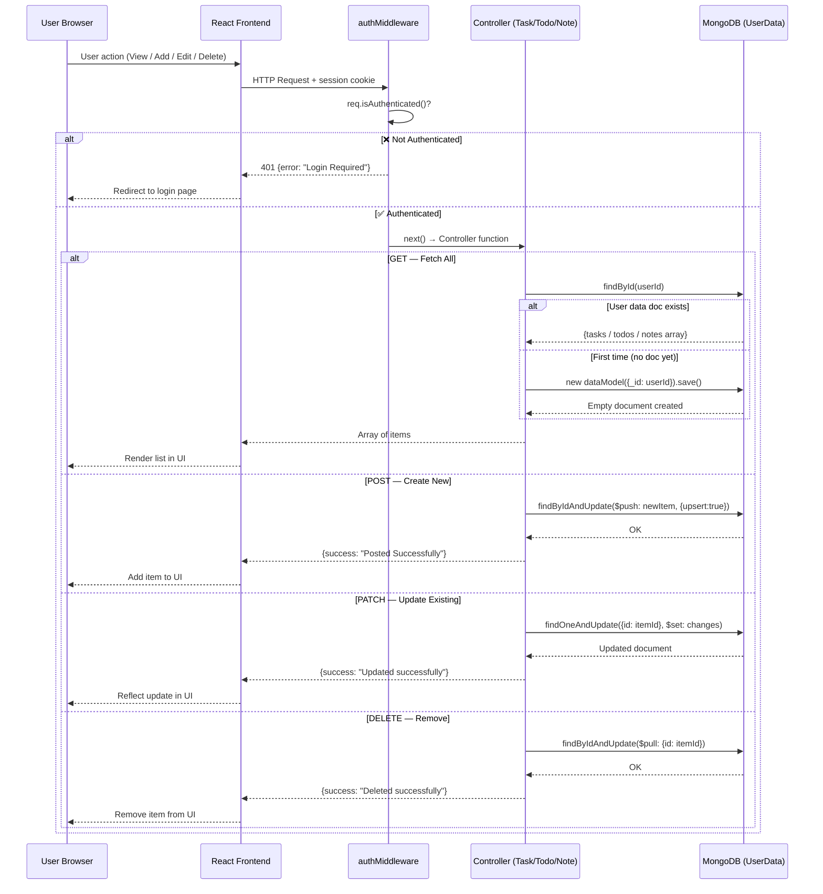
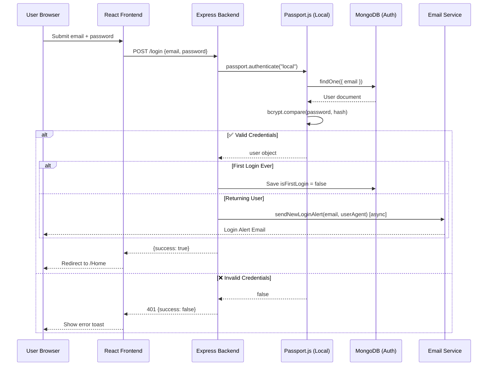
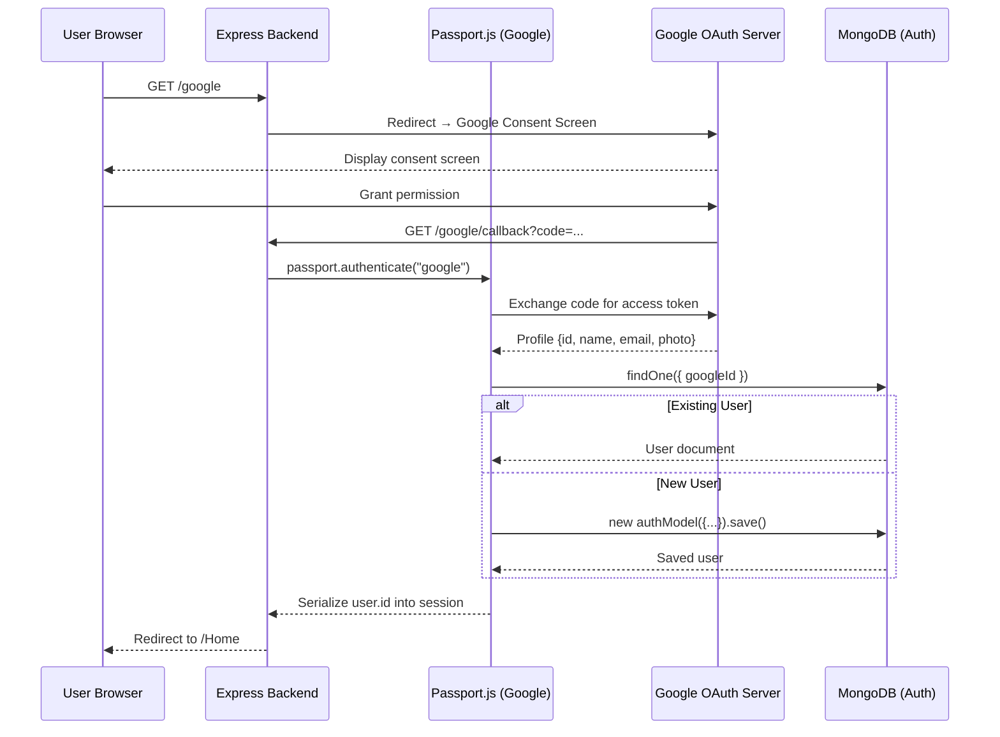
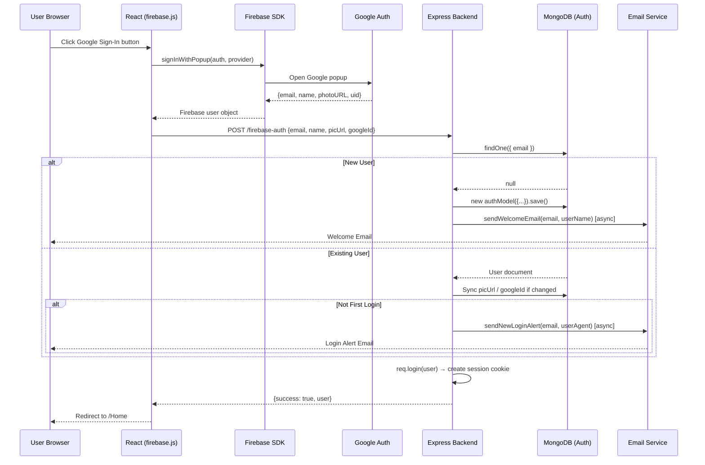
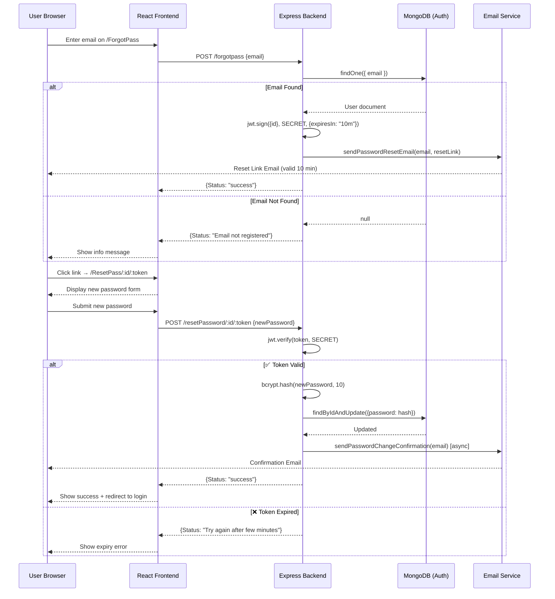
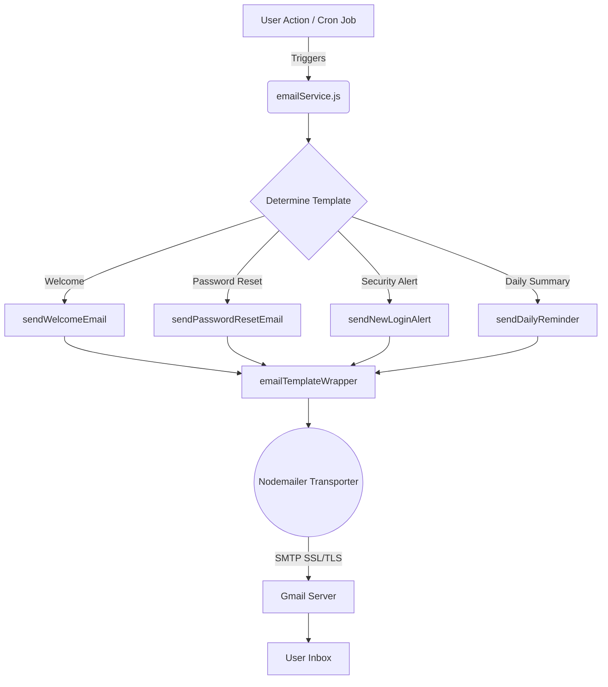
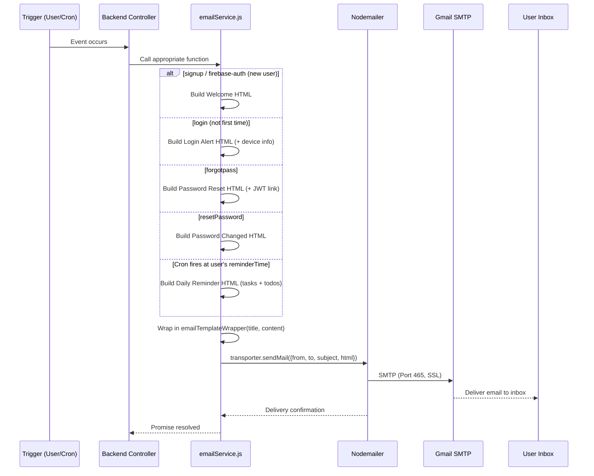
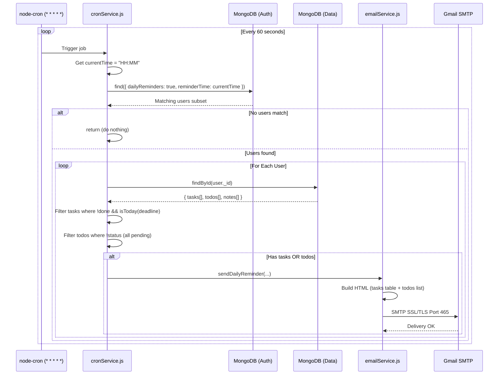

<p align="center">
  
</p>

<h1 align="center">📘 Enjaz Task Manager — Project Book</h1>
<p align="center"><em>Comprehensive Technical Documentation — Version 2.0</em></p>

---

## Table of Contents

1. [Project Overview](#1-project-overview)
2. [Architecture & Design Pattern](#2-architecture--design-pattern)
3. [Technology Stack (Detailed)](#3-technology-stack-detailed)
4. [Database Design](#4-database-design)
5. [Backend — Detailed Breakdown](#5-backend--detailed-breakdown)
6. [Frontend — Detailed Breakdown](#6-frontend--detailed-breakdown)
7. [Authentication System](#7-authentication-system)
8. [Email Notification System](#8-email-notification-system)
9. [Scheduled Jobs (Cron)](#9-scheduled-jobs-cron)
10. [API Reference (All 30 Endpoints)](#10-api-reference-all-30-endpoints)
11. [Environment Variables](#11-environment-variables)
12. [File-by-File Reference](#12-file-by-file-reference)

---

## 1. Project Overview

### What is Enjaz?

**Enjaz** (إنجاز — Arabic for "Achievement") is a full-stack task management web application built using the **MERN Stack** (MongoDB, Express.js, React.js, Node.js). It enables users to manage their productivity through three core modules: **Tasks**, **To-Do Lists**, and **Notes**.

### Core Objectives

- Provide a **unified dashboard** for all productivity tools
- Support **multiple authentication methods** (Local, Google OAuth, Firebase)
- Deliver a **professional email notification system** for account security and reminders
- Offer a **responsive, modern UI** with full Dark Mode support

### Target Audience

- University students organizing assignments and projects
- Professionals managing work deadlines
- Freelancers tracking client deliverables
- Anyone seeking a centralized productivity tool

---

## 2. Architecture & Design Pattern

### MVC (Model-View-Controller)

The project strictly follows the **MVC architectural pattern**:

```
┌─────────────────────────────────────────────────────┐
│                    CLIENT (React)                     │
│  Pages → Components → API Layer → Axios → HTTP       │
└────────────────────────┬────────────────────────────┘
                         │ HTTP Requests
┌────────────────────────▼────────────────────────────┐
│                   SERVER (Express)                    │
│                                                       │
│  Routes ──→ Middleware ──→ Controllers ──→ Models     │
│  (URLs)     (Auth Guard)   (Logic)        (MongoDB)  │
└─────────────────────────────────────────────────────┘
```

| Layer | Role | Files |
|-------|------|-------|
| **Model** | Database schemas & data access | `Models/Model.js`, `Models/DataModel.js` |
| **View** | React UI components & pages | `pages/*`, `components/*` |
| **Controller** | Business logic & request handling | `Controllers/*.js` |
| **Routes** | URL mapping to controllers | `Routes/*.js` |
| **Middleware** | Authentication guard | `Middlewares/authMiddleware.js` |
| **Utils** | Reusable services (email) | `Utils/emailService.js` |

### 2.1 Architectural Decisions: Client-Side Timestamps
In modern web applications, the global standard is for the Backend to generate timestamps using UTC (`Date.now()`), leaving the Frontend to handle timezone conversions. However, Enjaz intentionally deviates from this for Notes and Tasks.
- **The Enjaz Approach:** Timestamps (creation time and date) are generated by the React Frontend using the user's local device clock (`new Date()`) and passed directly as strings to the Express Backend.
- **The Rationale:** Since Enjaz is a strictly **Personal Task Manager** (single-user context with no cross-timezone collaborative features), the user's local device time is the most relevant Single Source of Truth. 
- **The Engineering Benefit:** This decision completely bypasses the overhead of complex timezone offset conversions, resulting in a significantly lighter backend storage structure and instantaneous UI rendering without date-parsing libraries.

---

## 3. Technology Stack (Detailed)

### 3.1 Backend Technologies

| Package | Version | Purpose | Used In |
|---------|---------|---------|---------|
| `express` | 4.18.2 | Web framework for HTTP handling | `index.js` |
| `mongoose` | 8.0.0 | MongoDB ODM for schema-based data modeling | `Models/*.js` |
| `passport` | 0.6.0 | Authentication middleware | `passport.js` |
| `passport-google-oauth20` | 2.0.0 | Google OAuth 2.0 strategy | `passport.js` |
| `passport-local` | 1.0.0 | Email/password login strategy | `passport.js` |
| `bcrypt` | 5.1.1 | Password hashing (salt rounds: 10) | `authController.js` |
| `jsonwebtoken` | 9.0.2 | JWT for password reset tokens (10min expiry) | `authController.js` |
| `express-session` | 1.17.3 | Server-side session management | `index.js` |
| `connect-mongo` | 5.1.0 | Store sessions in MongoDB | `index.js` |
| `nodemailer` | 6.9.7 | Send branded HTML emails via Gmail SMTP | `Utils/emailService.js` |
| `node-cron` | 4.2.1 | Schedule daily reminder emails | `cronService.js` |
| `cors` | 2.8.5 | Cross-Origin Resource Sharing | `index.js` |
| `dotenv` | 16.3.1 | Load environment variables from `.env` | `index.js` |
| `nodemon` | 3.0.1 | Auto-restart server on file changes | `package.json` scripts |

### 3.2 Frontend Technologies

| Package | Purpose | Used In |
|---------|---------|---------|
| `react` 18.2.0 | UI component framework | All components |
| `react-router-dom` 6.18.0 | Client-side routing & navigation | `App.js` |
| `axios` 1.6.0 | HTTP client for API calls | `api/*.js` |
| `@mui/material` 5.14.20 | Material UI DatePicker & Calendar | `Task.js`, `Todo.js`, `Calendar.js` |
| `firebase` 12.12.0 | Google Auth popup & user sync | `firebase.js`, `Mainpage.js` |
| `react-toastify` 9.1.3 | Toast notification messages | All pages |
| `react-easy-crop` | Profile photo crop & resize tool | `Settings.js` |
| `aos` | Animate-On-Scroll library | `Home.js`, `Settings.js` |
| `typewriter-effect` | Typewriter animation for quotes | `Settings.js` |
| `react-icons` | Icon library (Fa, Io, Md, Bi, etc.) | Multiple components |
| `react-spinners` | Loading spinner on page load | `Home.js` |

### 3.3 Database

- **Engine**: MongoDB (Local or Atlas Cloud)
- **ODM**: Mongoose 8.0.0
- **Databases Used**: 2 separate connections via `mongoose.createConnection()`
  - **Authentication DB**: Stores user credentials (`Model.js`)
  - **Data DB**: Stores user tasks, todos, notes (`DataModel.js`)
- **Session Store**: MongoDB via `connect-mongo`

---

## 4. Database Design

### 4.1 Authentication Schema (`Model.js`)

```javascript
{
  userName:       String (required),          // Display name
  email:          String (required),          // Unique email address
  password:       String (default: null),     // Hashed password (null for OAuth users)
  googleId:       String (default: null),     // Google OAuth ID
  fbId:           String (default: null),     // Reserved for Facebook
  picUrl:         String (default: icon URL), // Profile picture URL
  reminderTime:   String (default: "07:00"), // Daily reminder time in HH:MM format
  dailyReminders: Boolean (default: true),   // Toggle for daily reminder emails
  isFirstLogin:   Boolean (default: true),   // Used to skip login alert on first login
}
```

### 4.2 User Data Schema (`DataModel.js`)

```javascript
{
  _id: ObjectId (matches auth user _id),

  todos: [{
    todoId:    String,   // Unique identifier
    title:     String,   // Todo text
    status:    Boolean,  // Completed or not
    dateAdded: String,   // Date string (e.g., "23 Apr 2026")
    category:  String,   // Category label (General, Work, etc.)
  }],

  notes: [{
    id:       String,
    title:    String,
    noteText: String,
    date:     String,
    time:     String,
    pinned:   Boolean (default: false),
    pinnedAt: Number  (default: 0),  // Timestamp for LIFO pin ordering
  }],

  tasks: [{
    id:   String,
    task: {
      taskName: String,
      priority: String,   // "top", "average", "low"
      deadline: String,   // ISO date string
    },
    done: Boolean,
  }],
}
```

> **Design Decision**: The `_id` in `DataModel` matches the `_id` from the auth model. This allows a 1:1 relationship between user accounts and their data using `findById()`.

---

## 5. Backend — Detailed Breakdown

### 5.1 Entry Point (`index.js`)

The main server file responsible for:
- Loading environment variables via `dotenv`
- Configuring Express middleware (CORS, JSON parsing, sessions)
- Initializing Passport.js authentication
- Mounting all route groups
- Starting the HTTP server and cron jobs

**Route Mounting**:
| Prefix | Router | Description |
|--------|--------|-------------|
| `/` | `AuthRoutes` | Authentication, profile, social, password reset |
| `/todo` | `TodoRoutes` | Todo CRUD operations |
| `/note` | `NoteRoutes` | Note CRUD operations |
| `/task` | `TaskRoutes` | Task CRUD operations |

### 5.2 Passport Configuration (`passport.js`)

Implements two Passport.js strategies:

**Google Strategy**: Authenticates via Google OAuth 2.0. On callback, it either finds an existing user by `googleId` or creates a new account with Google profile data (name, email, photo).

**Local Strategy**: Authenticates via email and password. Uses `bcrypt.compare()` to verify the hashed password stored in MongoDB.

**Serialization**: Stores only `user.id` in the session. On each request, `deserializeUser` fetches the full user document from MongoDB.

### 5.3 Controllers

#### `authController.js` — 11 exported functions

| Function | Route | Description |
|----------|-------|-------------|
| `signup` | POST `/signup` | Creates user with hashed password, sends welcome email |
| `login` | POST `/login` | Authenticates via Passport local, sends login alert email |
| `firebaseAuth` | POST `/firebase-auth` | Creates or syncs user from Firebase/Google, sends welcome or login alert |
| `logout` | GET `/logout` | Destroys session and clears cookies |
| `getUser` | GET `/getUser` | Returns current authenticated user data |
| `forgotPassword` | POST `/forgotpass` | Generates JWT reset token, sends reset email |
| `resetPassword` | POST `/resetPassword/:id/:token` | Verifies JWT, updates password, sends confirmation email |
| `editProfile` | POST `/editProfile` | Updates display name only |
| `updateFullProfile` | POST `/updateFullProfile` | Updates name, email, photo, and optionally password |
| `updateNotifSettings` | POST `/updateNotifSettings` | Updates `dailyReminders` toggle and `reminderTime` in MongoDB |
| `deleteAccount` | POST `/deleteAccount` | Verifies password, deletes user + all data, destroys session |

#### `todoController.js` — 4 exported functions

| Function | Route | Description |
|----------|-------|-------------|
| `getTodos` | GET `/todo/getTodo` | Returns user's todo array (creates data doc if none exists) |
| `postTodo` | POST `/todo/postTodo` | Pushes new todo to array |
| `updateTodo` | PATCH `/todo/updateTodo/:todoId` | Generic update using dynamic `$set` query building |
| `deleteTodo` | DELETE `/todo/deleteTodo/:todoId` | Pulls todo from array by `todoId` |

#### `noteController.js` — 4 exported functions

| Function | Route | Description |
|----------|-------|-------------|
| `getNotes` | GET `/note/getNote` | Returns user's notes array |
| `postNote` | POST `/note/postNote` | Pushes new note to array |
| `updateNote` | PATCH `/note/updateNote/:id` | Updates specific fields (text, title, pin, date, time) |
| `deleteNote` | DELETE `/note/deleteNote/:id` | Pulls note from array by `id` |

#### `taskController.js` — 4 exported functions

| Function | Route | Description |
|----------|-------|-------------|
| `getTasks` | GET `/task/getTask` | Returns user's tasks array |
| `postTask` | POST `/task/postTask` | Pushes new task to array |
| `updateTask` | PATCH `/task/updateTask/:id` | Updates task status or task details |
| `deleteTask` | DELETE `/task/deleteTask/:id` | Pulls task from array by `id` |

### 5.4 Middleware (`authMiddleware.js`)

A single-purpose middleware that checks `req.isAuthenticated()` (Passport method). If the user is not logged in, it returns a `401` response. Applied globally to all Todo, Note, and Task routes via `router.use(authenticator)`.

### 5.5 Routes

| File | Prefix | # Endpoints | Auth Applied |
|------|--------|-------------|--------------|
| `AuthRoutes.js` | `/` | 16 (12 active + 4 placeholder) | Mixed (some public, some protected) |
| `TodoRoutes.js` | `/todo` | 4 | All protected via `router.use()` |
| `NoteRoutes.js` | `/note` | 4 | All protected via `router.use()` |
| `TaskRoutes.js` | `/task` | 4 | All protected via `router.use()` |

### 5.6 CRUD Operations — Sequence Diagram

> This single diagram covers the request/response lifecycle for **Tasks, Todos, and Notes** — all three follow the identical pattern.



---

## 6. Frontend — Detailed Breakdown

### 6.1 Application Entry (`App.js`)

- Wraps the app in `BrowserRouter` for client-side routing
- Manages global state for `notes`, `tasks`, and `todo` arrays
- Provides a `clearAllData()` function for logout cleanup
- Configures `ToastContainer` for notifications

**Route Map**:
| Path | Component | Description |
|------|-----------|-------------|
| `/` | `AuthPage` (Toggler) | Login/Register page |
| `/ForgotPass` | `ForgotPass` | Forgot password form |
| `/ResetPass/:id/:token` | `ResetPass` | Reset password form |
| `/Home` | `Home` (layout) | Main app layout with sidebar |
| `/Home` (index) | `Dashboard` | Dashboard overview |
| `/Home/todos` | `Todo` | Todo list management |
| `/Home/notes` | `Notes` | Notes management |
| `/Home/task` | `Task` | Task management |
| `/Home/settings` | `Settings` | Settings (tabbed: Profile, Security, Notifications, Account Actions) |

> **Security**: All `/Home/*` routes are wrapped in a `ProtectedRoute` component that checks authentication via `authApi.getUser()` before rendering. Unauthenticated users are redirected to `/`.

### 6.2 API Layer (`api/`)

Centralized API communication using Axios:

- **`apiConfig.js`**: Creates an Axios instance with `baseURL` and `withCredentials: true` for cookie-based sessions
- **`authApi.js`**: 11 functions (login, signup, logout, getUser, firebaseAuth, forgotPassword, resetPassword, editProfile, updateFullProfile, updateNotifSettings, deleteAccount)
- **`todoApi.js`**: 4 functions (getTodos, postTodo, updateTodo, deleteTodo)
- **`noteApi.js`**: 4 functions (getNotes, postNote, updateNote, deleteNote)
- **`taskApi.js`**: 4 functions (getTasks, postTask, updateTask, deleteTask)

### 6.3 Pages

#### Auth Pages (`pages/Auth/`)
- **`Toggler.js`**: Wrapper that manages login/signup form toggling with slide animation
- **`Mainpage.js`**: Contains both Login and SignUp forms, Google/Apple/Microsoft auth buttons, password visibility toggle, email domain validation
- **`ForgotPass.js`**: Email input form that calls `/forgotpass` API
- **`ResetPass.js`**: New password form that extracts `id` and `token` from URL params

#### Dashboard (`pages/Dashboard/`)
- **`Dashboard.js`**: Grid layout with 4 cards (Notes, Calendar, Todos, Tasks Overview)
- **`MainNote.js`**: Shows latest 3 notes in mini-card format
- **`MainTodo.js`**: Shows latest 5 todos with checkbox and relative dates (Today, Tomorrow, etc.)
- **`MainTask.js`**: Table view of tasks with priority and status pills

#### Tasks (`pages/Tasks/`)
- **`Task.js`**: Full task management with add panel, inline editing, bulk selection/deletion, custom dropdown selects, separate sections for current and completed tasks with collapsible dropdown

#### Todos (`pages/Todos/`)
- **`Todo.js`**: Todo list with add form, category selection (with custom category input), inline editing, date picker, category badges with consistent styling

#### Notes (`pages/Notes/`)
- **`Notes.js`**: Note cards with pin-to-top (LIFO ordering via `pinnedAt` timestamp), add/edit/delete functionality

#### Settings (`pages/Settings/`)
- **`Settings.js`**: Sidebar tabbed layout (industry standard) with four tabs:
  1. **Profile**: Avatar with camera upload, crop tool, name editing
  2. **Security**: Password change with current/new/confirm fields
  3. **Notifications**: Toggle email preferences (Login Alerts, Daily Reminders with custom time picker) — settings are persisted to **MongoDB** via `POST /updateNotifSettings`, ensuring they sync across all devices and sessions
  4. **Account Actions**: Delete account (with password confirmation dialog) and Log Out (with confirmation dialog)
- Renders the **right sidebar** (calendar, quotes, notifications) when not on the settings page
- **Midnight Auto-Refresh**: Bell notifications automatically re-fetch at midnight via `setTimeout` to reflect the new day's tasks

### 6.4 Shared Components

| Component | File | Purpose |
|-----------|------|---------|
| **Navbar** | `Navbar.js` | Sidebar navigation with collapsible/mobile modes, brand logo, nav links, settings link |
| **TopHeader** | `TopHeader.js` | Top bar with hamburger menu, search bar, dark mode toggle, notifications bell, profile dropdown |
| **Calendar** | `Calendar/Calendar.js` | MUI DateCalendar with today's date highlighted in green |
| **DarkMode** | `DarkMode/Darkmode.js` | Theme toggle button that saves preference to localStorage |
| **Notification** | `Notification/Notification.js` | Bell dropdown showing tasks due today |
| **Note** | `Notes/Note.js` | Individual note card component with pin/edit/delete actions |
| **Dialog** | `SrNoDialog/Dialog.js` | Reusable confirmation dialog for delete operations |
| **ProtectedRoute** | `ProtectedRoute.js` | Auth guard — redirects unauthenticated users to login |

---

## 7. Authentication System

Enjaz supports **three** authentication methods:

### 7.1 Local Authentication (Email/Password)
1. User submits email + password via login form
2. Frontend sends `POST /login` to backend
3. Passport Local Strategy finds user by email
4. `bcrypt.compare()` verifies password against stored hash
5. On success: session created, login alert email sent, user redirected to `/Home`

### 7.2 Google OAuth 2.0 (via Passport)
1. User clicks Google button → redirected to `/google`
2. Passport redirects to Google consent screen
3. Google returns to `/google/callback` with profile data
4. Passport callback creates or finds user in DB
5. Session created, user redirected to `/Home`

### 7.3 Firebase Google Auth (via Frontend SDK)
1. User clicks Google button → `signInWithPopup()` opens Google popup
2. Firebase returns user object (email, name, photoURL, uid)
3. Frontend sends this data to `POST /firebase-auth`
4. Backend creates or syncs user, syncs profile photo, starts session
5. Welcome email (new user) or login alert (existing user) sent

### Password Reset Flow
1. User enters email on Forgot Password page
2. Backend generates JWT (10-minute expiry) with user ID
3. Reset link emailed: `{FRONTEND}/ResetPass/{userId}/{token}`
4. User clicks link, enters new password
5. Backend verifies JWT, hashes new password, updates DB
6. Password change confirmation email sent

### 7.5 Authentication — Sequence Diagrams

#### Local Authentication (Signup / Login)



#### Google OAuth 2.0 (Server-Side Redirect)



#### Firebase Google Auth (Client-Side Popup)



#### Password Reset Flow



---


## 8. Email Notification System (emailService.js)

The Enjaz application features an advanced, fully-responsive email notification system designed to keep users engaged and informed.

### Architecture Diagram


### Execution Sequence Diagram


### What Was Used and Why?
1. **Nodemailer:** We used the `nodemailer` package configured with Gmail SMTP (Port 465, Secure SSL/TLS) because it is the industry standard for sending robust, reliable emails from a Node.js server.
2. **Dynamic HTML Templates:** We created a centralized `emailTemplateWrapper` function. **Why?** To ensure visual consistency. Every email shares the same professional Enjaz branding (Gradient Headers, Box Shadows, Dynamic Viewport scaling for mobile).
3. **Data Injection:** The daily reminder takes `tasksArray` and `todosArray` directly from the DB, iterates through them, and generates clean HTML tables and lists. 

### Why the Mobile Responsive Meta Tags?
Emails rendered on mobile devices often suffer from "squishing" or forced zooming. By injecting `<meta name="viewport" content="width=device-width, initial-scale=1.0">`, and utilizing CSS media queries to reduce padding on smaller screens, we guarantee the user gets a pixel-perfect layout on both Desktop and Mobile.

---

## 9. Scheduled Jobs (Cron & DB Filtering)

The Daily Agenda Reminder requires a robust scheduling system to notify users at their specifically chosen time.

### Architecture Diagram


### The "Every Minute" Strategy vs The "Every User" Loop
**The Problem:** We need to send users an email at exactly the time they chose (e.g., 07:15 AM, 08:30 PM). 
**The Naive Approach (Wrong):** Run a cron job every minute, pull *all 100,000 users* into server memory, and check if their time matches. This would crash the Node Server.
**Our Enterprise Approach (Correct):**
- We use `node-cron` to run a job every minute (`* * * * *`).
- Inside the job, we get the current server minute (e.g., `08:30`).
- We execute a **Targeted Database Query**: `authModel.find({ reminderTime: "08:30" })`.
- **Why this is powerful:** The Database engine (MongoDB) handles the filtering. It only returns the exact subset of users who need an email *right now*. This turns an $O(N)$ memory-heavy operation into an $O(1)$ fast lookup, matching how large-scale enterprise systems handle scheduled jobs without needing external message queues like Redis/BullMQ.

### Todo vs Task Logic
- **Tasks** have strict deadlines. The cron checks: `isToday(task.deadline)`.
- **Todos** are continuous checklists. The cron ignores dates entirely for Todos and strictly checks `!todo.status` (Is it pending?). This perfectly mirrors real-world productivity workflows.


## 10. API Reference (All 30 Endpoints)

### Core CRUD (12 Endpoints)

#### Tasks
| # | Method | Endpoint | Request Body | Response |
|---|--------|----------|-------------|----------|
| 1 | GET | `/task/getTask` | — | `[{id, task: {taskName, priority, deadline}, done}]` |
| 2 | POST | `/task/postTask` | `{id, task: {taskName, priority, deadline}, done}` | `{success: "Posted Successfully"}` |
| 3 | PATCH | `/task/updateTask/:id` | `{done: true}` or `{task: {...}}` | `{success: "Updated successfully"}` |
| 4 | DELETE | `/task/deleteTask/:id` | — | `{success: "Deleted successfully"}` |

#### Todos
| # | Method | Endpoint | Request Body | Response |
|---|--------|----------|-------------|----------|
| 5 | GET | `/todo/getTodo` | — | `[{todoId, title, status, dateAdded, category}]` |
| 6 | POST | `/todo/postTodo` | `{todoId, title, status, dateAdded, category}` | `{success: "Posted Successfully"}` |
| 7 | PATCH | `/todo/updateTodo/:todoId` | `{title: "..."}` or `{status: true}` | `{success: "Updated successfully"}` |
| 8 | DELETE | `/todo/deleteTodo/:todoId` | — | `{success: "Deleted successfully"}` |

#### Notes
| # | Method | Endpoint | Request Body | Response |
|---|--------|----------|-------------|----------|
| 9 | GET | `/note/getNote` | — | `[{id, title, noteText, date, time, pinned, pinnedAt}]` |
| 10 | POST | `/note/postNote` | `{id, title, noteText, date, time}` | `{success: "Posted Successfully"}` |
| 11 | PATCH | `/note/updateNote/:id` | `{newText, newTitle, pinned, pinnedAt}` | `{success: "Updated successfully"}` |
| 12 | DELETE | `/note/deleteNote/:id` | — | `{success: "Deleted successfully"}` |

### Auth & Account (14 Active + 4 Placeholders)

| # | Method | Endpoint | Auth | Request Body | Response |
|---|--------|----------|------|-------------|----------|
| 13 | GET | `/` | ❌ | — | `{status, version}` |
| 14 | POST | `/signup` | ❌ | `{userName, email, password}` | User object |
| 15 | POST | `/login` | ❌ | `{email, password}` | `{success, message}` |
| 16 | GET | `/logout` | ✅ | — | `{success, message}` |
| 17 | GET | `/getUser` | ✅ | — | User object |
| 18 | POST | `/editProfile` | ✅ | `{newName}` | `{success, newName}` |
| 19 | POST | `/updateFullProfile` | ✅ | `{userName, email, picUrl, oldPassword?, newPassword?}` | `{success, message}` |
| 20 | POST | `/updateNotifSettings` | ✅ | `{dailyReminders?, reminderTime?}` | `{success, message}` |
| 21 | POST | `/deleteAccount` | ✅ | `{password}` | `{success, message}` |
| 22 | POST | `/forgotpass` | ❌ | `{email}` | `{Status}` |
| 23 | POST | `/resetPassword/:id/:token` | ❌ | `{newPassword}` | `{Status}` |
| 24 | POST | `/firebase-auth` | ❌ | `{email, name, picUrl, googleId}` | `{success, user}` |
| 25 | GET | `/google` | ❌ | — | Redirect to Google |
| 26 | GET | `/google/callback` | ❌ | — | Redirect to Frontend |
| 27-30 | GET | `/microsoft`, `/microsoft/callback`, `/apple`, `/apple/callback` | — | — | Placeholder redirects |

---

## 11. Environment Variables

### Backend (`BackEnd/.env`)

| Variable | Required | Description |
|----------|----------|-------------|
| `MONGO_URL` | ✅ | MongoDB connection string |
| `GOOGLE_CLIENT_ID` | ✅ | Google OAuth 2.0 Client ID |
| `GOOGLE_CLIENT_SECRET` | ✅ | Google OAuth 2.0 Client Secret |
| `FRONTEND_DOMAIN` | ✅ | Frontend URL for redirects and email links |
| `SESSION_SECRET` | ✅ | Secret key for express-session |
| `JWT_SECRET_KEY` | ✅ | Secret key for JWT token signing |
| `PORT` | ✅ | Server port (default: 8080) |
| `GOOGLE_CALLBACK_URL` | ✅ | Full URL for Google OAuth callback |
| `EMAIL_USER` | ✅ | Gmail address for sending emails |
| `EMAIL_PASS` | ✅ | Gmail App Password (not regular password) |

### Frontend (`.env` or environment)

| Variable | Description |
|----------|-------------|
| `REACT_APP_API_URL` | Backend API base URL (default: `http://localhost:8080`) |
| `REACT_APP_FIREBASE_API_KEY` | Firebase API Key |
| `REACT_APP_FIREBASE_AUTH_DOMAIN` | Firebase Auth Domain |
| `REACT_APP_FIREBASE_PROJECT_ID` | Firebase Project ID |
| `REACT_APP_FIREBASE_STORAGE_BUCKET` | Firebase Storage Bucket |
| `REACT_APP_FIREBASE_MESSAGING_SENDER_ID` | Firebase Messaging Sender ID |
| `REACT_APP_FIREBASE_APP_ID` | Firebase App ID |
| `REACT_APP_FIREBASE_MEASUREMENT_ID` | Firebase Measurement ID |

---

## 12. File-by-File Reference

### Backend Files (15 files)

| File | Lines | Purpose |
|------|-------|---------|
| `index.js` | ~56 | Server entry point, middleware, routes, cron |
| `passport.js` | ~72 | Google & Local auth strategies, serialization |
| `cronService.js` | ~86 | Daily email reminder scheduler |
| `Controllers/authController.js` | ~302 | 11 auth/profile functions |
| `Controllers/todoController.js` | ~63 | 4 todo CRUD functions |
| `Controllers/noteController.js` | ~64 | 4 note CRUD functions |
| `Controllers/taskController.js` | ~60 | 4 task CRUD functions |
| `Routes/AuthRoutes.js` | ~45 | 15 auth/profile/social routes |
| `Routes/TodoRoutes.js` | ~14 | 4 todo routes |
| `Routes/NoteRoutes.js` | ~14 | 4 note routes |
| `Routes/TaskRoutes.js` | ~14 | 4 task routes |
| `Middlewares/authMiddleware.js` | ~9 | Session auth guard |
| `Utils/emailService.js` | ~353 | 5 branded email templates + shared HTML wrapper |
| `Models/Model.js` | ~43 | User auth schema |
| `Models/DataModel.js` | ~57 | User data schema (todos, notes, tasks) |

### Frontend Files (25+ files)

| File | Purpose |
|------|---------|
| `App.js` | Root component, routing, global state |
| `App.css` | Auth page styles, glassmorphism |
| `firebase.js` | Firebase client config |
| `api/apiConfig.js` | Axios base setup |
| `api/authApi.js` | 10 auth API functions |
| `api/todoApi.js` | 4 todo API functions |
| `api/noteApi.js` | 4 note API functions |
| `api/taskApi.js` | 4 task API functions |
| `pages/Auth/Mainpage.js` | Login & Register forms |
| `pages/Auth/Toggler.js` | Auth page wrapper |
| `pages/Auth/ForgotPass.js` | Forgot password page |
| `pages/Auth/ResetPass.js` | Reset password page |
| `pages/Home/Home.js` | Main layout (sidebar + content + footer) |
| `pages/Dashboard/Dashboard.js` | Dashboard grid layout |
| `pages/Tasks/Task.js` | Full task management UI |
| `pages/Todos/Todo.js` | Todo list management UI |
| `pages/Notes/Notes.js` | Notes management UI |
| `pages/Settings/Settings.js` | Profile, Security, Notifications, Account Actions (tabbed layout) |
| `components/Navbar.js` | Sidebar navigation |
| `components/TopHeader.js` | Top header bar |
| `components/ProtectedRoute.js` | Auth guard — redirects unauthenticated users |
| `components/Calendar/Calendar.js` | MUI DateCalendar widget |
| `components/DarkMode/Darkmode.js` | Theme toggle |
| `components/Notification/Notification.js` | Bell notification dropdown |
| `components/Notes/Note.js` | Individual note card |
| `components/SrNoDialog/Dialog.js` | Confirmation dialog |

---

<p align="center">
  <strong>End of Project Book</strong><br/>
  <em>Enjaz Task Manager — Built by Shawky Mohamed</em>
</p>
